# konami-fpga

Konami arcade cores for **MiSTer**. · Cores arcade de **Konami** para **MiSTer**.

## Horizontal

<table>
<tr>
<td align="center" width="33%"><a href="DETAILS.md#asterix-konami-1993">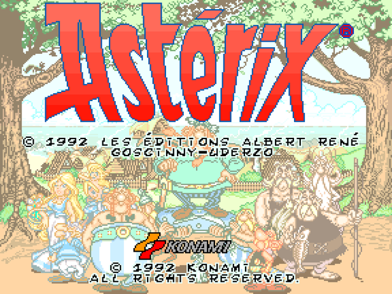</a><br><b>Asterix</b> · 1993</td>
<td align="center" width="33%"><a href="DETAILS.md#wild-west-cow-boys-of-moo-mesa-konami-1992">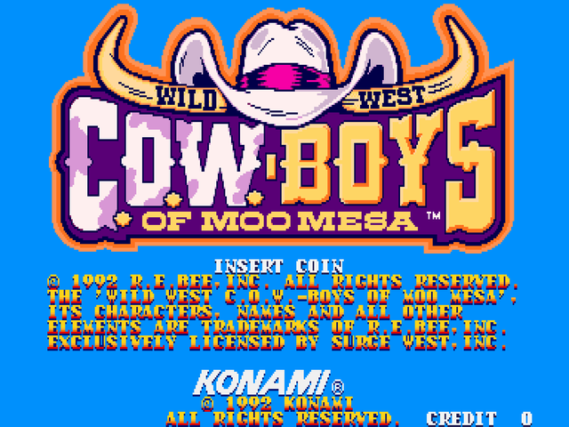</a><br><b>C.O.W.-Boys of Moo Mesa</b> · 1992</td>
<td align="center" width="33%"><a href="DETAILS.md#hot-chase-konami-1988">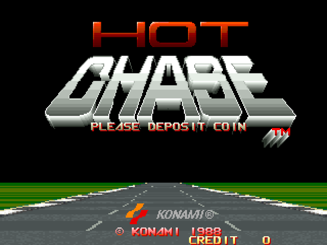</a><br><b>Hot Chase</b> · 1988</td>
</tr>
<tr>
<td align="center" width="33%"><a href="DETAILS.md#konami-gt-konami-1985">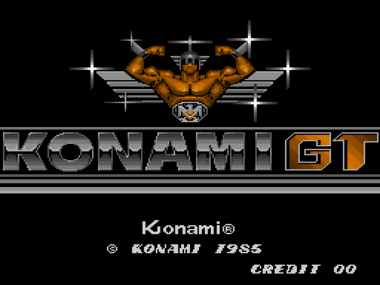</a><br><b>Konami GT</b> · 1985</td>
<td align="center" width="33%"><a href="DETAILS.md#martial-champion-konami-1993">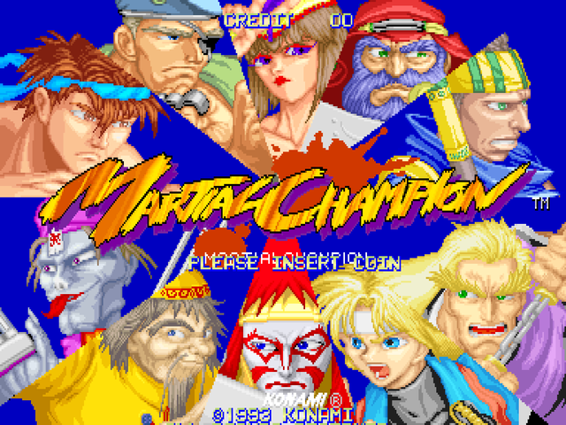</a><br><b>Martial Champion</b> · 1993</td>
<td align="center" width="33%"><a href="DETAILS.md#mystic-warriors-wrath-of-the-ninjas-konami-1993">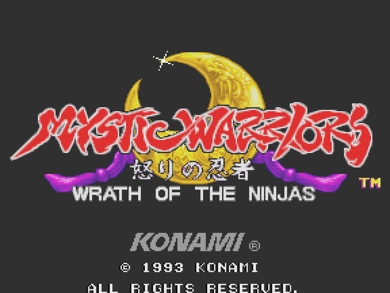</a><br><b>Mystic Warriors</b> · 1993</td>
</tr>
<tr>
<td align="center" width="33%"><a href="DETAILS.md#sunset-riders-konami-1991">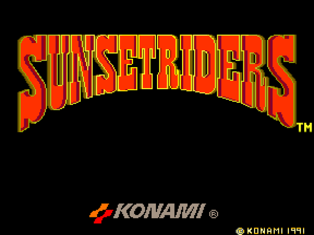</a><br><b>Sunset Riders</b> · 1991</td>
<td align="center" width="33%"><a href="DETAILS.md#wec-le-mans-24-konami-1986">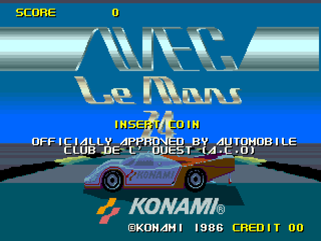</a><br><b>WEC Le Mans 24</b> · 1986</td>
<td align="center" width="33%"><a href="DETAILS.md#xexex-konami-1991">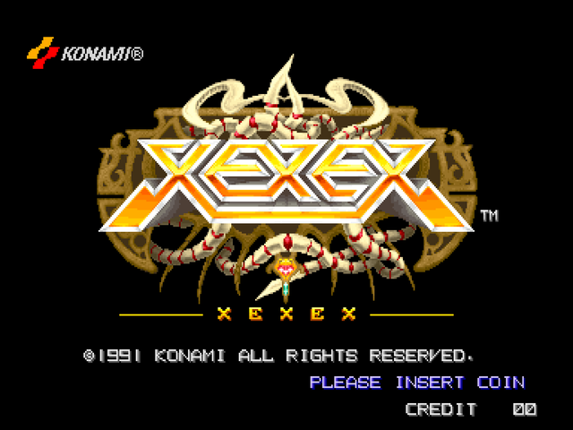</a><br><b>Xexex</b> · 1991</td>
</tr>
</table>

## Vertical

<table>
<tr>
<td align="center" width="33%"><a href="DETAILS.md#chequered-flag-konami-1988">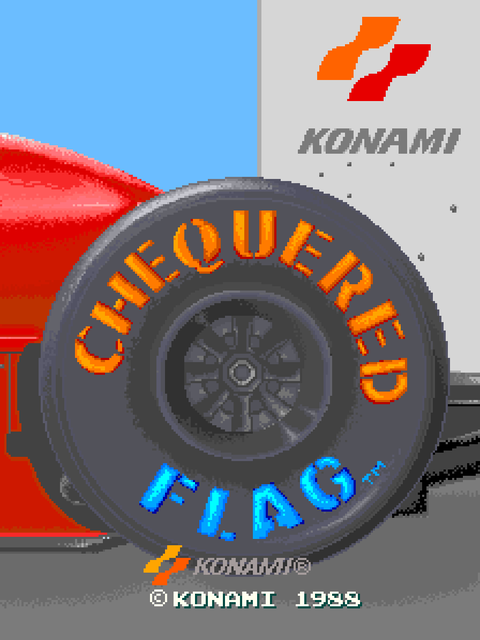</a><br><b>Chequered Flag</b> · 1988</td>
<td align="center" width="33%"><a href="DETAILS.md#detana-twin-bee-konami-1991">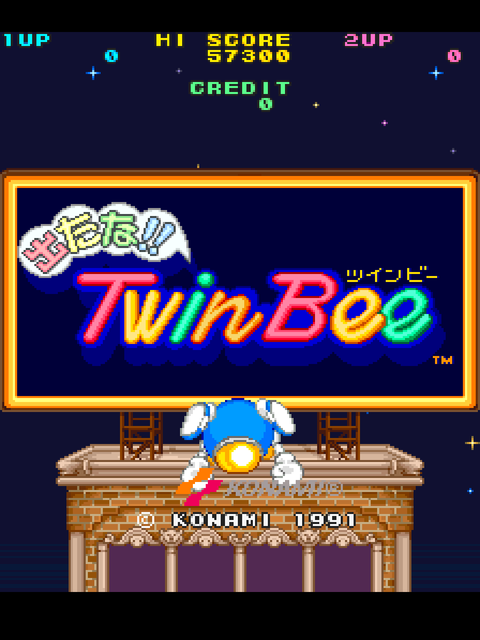</a><br><b>Detana!! Twin Bee</b> · 1991</td>
<td align="center" width="33%"><a href="DETAILS.md#over-drive-konami-1990">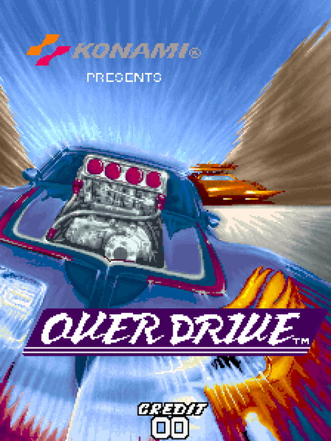</a><br><b>Over Drive</b> · 1990</td>
</tr>
</table>

## How to install the Konami cores on your MiSTer FPGA

Two options:

1. **Download and copy them yourself.** The `.rbf` cores are in [`releases/`](releases/) and go to `_Arcade/cores/` on
   the SD card; the `.mra` files are in `cores/<core>/mra/` and go to `_Arcade/`.
2. **Let the MiSTer Downloader do it.** Add the [jlrh-misterfpga-db](https://github.com/jlrh/jlrh-misterfpga-db)
   database to `downloader.ini` (root of the SD card) and run `Scripts → update`. It installs these cores **and the
   rest of jlrh's arcade cores** (Gaelco, Seibu, Inder, Cidelsa…), and keeps them all up to date.

```ini
[jlrh/jlrh-misterfpga-db]
db_url = https://raw.githubusercontent.com/jlrh/jlrh-misterfpga-db/db/db.json.zip
```

**ROMs are not included.** Bring your own MAME romsets (merged, MAME 0.288) into `games/mame/`. The exact set each core
expects is in [`ROMS.md`](https://github.com/jlrh/jlrh-misterfpga-db/blob/main/ROMS.md).

**More:** build instructions in [`BUILD.md`](BUILD.md); hardware, status, controls and credits of each core in
[`DETAILS.md`](DETAILS.md). Screenshots taken from MAME.

Built on the GPLv3 **JTFRAME** framework. Independent project — **not** an official jotego core. License: GPLv3
([`LICENSE`](LICENSE)).

## Cómo instalar los cores de Konami en tu MiSTer FPGA

Dos opciones:

1. **Descargarlos y copiarlos tú.** Los `.rbf` están en [`releases/`](releases/) y van a `_Arcade/cores/` en la SD;
   los `.mra` están en `cores/<core>/mra/` y van a `_Arcade/`.
2. **Que lo haga el MiSTer Downloader.** Añade la base de datos
   [jlrh-misterfpga-db](https://github.com/jlrh/jlrh-misterfpga-db) a `downloader.ini` (en la raíz de la SD) y ejecuta
   `Scripts → update`. Instala estos cores **y el resto de cores arcade de jlrh** (Gaelco, Seibu, Inder, Cidelsa…), y los
   mantiene todos al día.

```ini
[jlrh/jlrh-misterfpga-db]
db_url = https://raw.githubusercontent.com/jlrh/jlrh-misterfpga-db/db/db.json.zip
```

**Las ROMs no se incluyen.** Pon tus propios romsets de MAME (merged, MAME 0.288) en `games/mame/`. El set exacto que
espera cada core está en [`ROMS.md`](https://github.com/jlrh/jlrh-misterfpga-db/blob/main/ROMS.md).

**Más:** cómo compilar, en [`BUILD.md`](BUILD.md); hardware, estado, controles y créditos de cada core, en
[`DETAILS.md`](DETAILS.md). Capturas tomadas de MAME.

Hechos sobre el framework **JTFRAME** (GPLv3). Proyecto independiente — **no** es un core oficial de jotego. Licencia:
GPLv3 ([`LICENSE`](LICENSE)).
